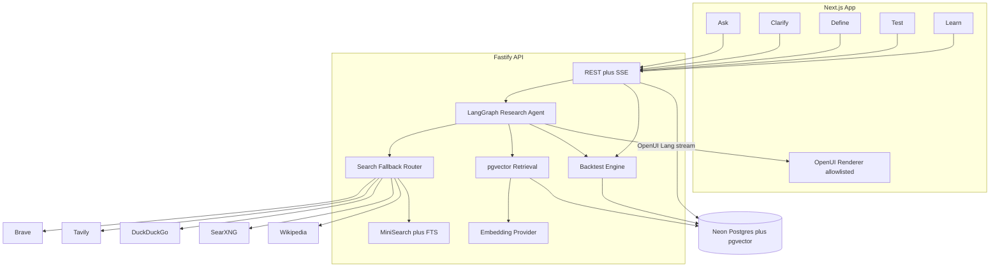

# TradeBorn: LangGraph Agent + Search Fallbacks

## Decisions (locked unless you change them)

- **LangGraph.js on the Fastify backend**, not Python. This matches the PRD’s Next.js + Node + Zod stack, keeps one language, and still gives real agentic tool calling (`createAgent` / `StateGraph` from `@langchain/langgraph` + `langchain`).
- **Deterministic backtest stays outside the LLM.** The agent may *call* `run_backtest` / `get_metrics` tools; it never computes or edits returns.
- **OpenUI Lang is in scope** for AI-generated panels. Use `@openuidev/react-lang` (`defineComponent`, `createLibrary`, streaming `Renderer`) with an **allowlisted** research library. Unknown component names are rejected. Never render raw HTML/JS from the model.
- **pgvector is in scope** for RAG. Knowledge docs are chunked, embedded, and retrieved with cosine similarity. Keyword MiniSearch / Postgres FTS remains the local last hop when embeddings or the vector query fail.
- **Neon Postgres, not Docker.** App and Prisma talk to an existing Neon project via `DATABASE_URL` (pooled) and `DIRECT_URL` (unpooled, migrations). Enable the `vector` extension on that database. No `docker-compose` Postgres.
- **Search never depends on one vendor.** The `web_search` tool tries providers in order; the first that returns results wins. Last hop is always the local engine, so search cannot hard-fail.

## Architecture



**Monorepo layout**

- [`apps/web`](apps/web) — Next.js App Router, Tailwind, shadcn/ui, Recharts, OpenUI `Renderer`
- [`apps/web/src/openui`](apps/web/src/openui) — allowlisted `defineComponent` library
- [`apps/api`](apps/api) — Fastify, Prisma, LangGraph agent, search router, RAG, backtest engine
- [`packages/shared`](packages/shared) — Zod experiment/session schemas + OpenUI spec JSON
- [`data/nifty50_daily.csv`](data/nifty50_daily.csv) — versioned sample OHLC with checksum
- [`data/knowledge/*.md`](data/knowledge) — methodology notes ingested into `knowledge_documents` / `knowledge_chunks`
- [`localrun.md`](localrun.md) — how to run locally (written last)

## 1. Foundation

pnpm workspaces, `.env.example` with Neon URLs, Prisma against **Neon Postgres** (no Docker database):

```env
DATABASE_URL=      # Neon pooled connection string (runtime, sslmode=require)
DIRECT_URL=        # Neon direct/unpooled string (Prisma migrate)
```

Prisma `datasource` uses `url = env("DATABASE_URL")` and `directUrl = env("DIRECT_URL")`. First migration runs `CREATE EXTENSION IF NOT EXISTS vector` (Neon supports pgvector). Prisma schema from PRD tables:

- `research_sessions`, `experiment_definitions`, `datasets`, `market_bars`, `backtest_runs`, `backtest_trades`
- `knowledge_documents`, `knowledge_chunks` (`embedding vector(...)`, metadata JSON)
- `search_cache` (query, provider, results, timestamp)

Enable `CREATE EXTENSION IF NOT EXISTS vector` in the first migration. Embedding column dimension must match the chosen embedding model (e.g. 1536 for `text-embedding-3-small`, 768 for nomic/Ollama). Store `embedding_model` on the dataset/chunk metadata so a model change requires a re-ingest, not a silent mismatch.

Seed:

- Import `data/nifty50_daily.csv` into `datasets` + `market_bars` with checksum and date coverage taken from the file (never hardcoded as a claim).
- Ingest `data/knowledge/*.md` (look-ahead bias, costs, overlapping trades, small-sample warnings) into `knowledge_documents` / `knowledge_chunks`, embed when an embedding key is present, and also index the same corpus in MiniSearch / FTS.

LLM / embedding factory (env-selected):

- `LLM_PROVIDER=openai|groq|google|ollama`
- `EMBEDDING_PROVIDER=openai|google|ollama` (optional; RAG degrades to FTS if unset)
- Default Groq/OpenAI-compatible so a free-tier key works; Ollama for fully offline.

## 2. LangGraph agent + tools

Custom `StateGraph` in [`apps/api/src/ai/graph.ts`](apps/api/src/ai/graph.ts) with session-scoped state: `question`, `clarification`, `experiment`, `metrics`, `warnings`, `messages`, `citations`, `openui`.

**Nodes**

- `interpret` — `withStructuredOutput(ClarificationSchema)` (PRD §8.2). Never treats defaults as user facts.
- `propose_experiment` — maps confirmed params to the experiment JSON in PRD §4 DEFINE.
- `retrieve` — pgvector similarity over `knowledge_chunks`, with FTS fallback.
- `explain` — grounded explanation + follow-ups; metrics injected as frozen context.
- `render_openui` — emits OpenUI Lang against the allowlisted library prompt (`library.prompt({ componentAllowlist })`), not free markdown, for Clarify/Learn AI panels.
- Tool node for search/knowledge/backtest reads.

**Tools** (`langchain` `tool()` + Zod)

- `web_search` — fallback router (below). Snippets labeled `source: web`, never as market data.
- `retrieve_knowledge` — pgvector cosine search (`1 - (embedding <=> $1)`), filtered by metadata topic; falls back to FTS/MiniSearch.
- `get_dataset_metadata` — coverage, version, checksum.
- `get_metrics` — read-only persisted backtest metrics.
- `run_backtest` — same engine as REST; UI still calls REST for the Test screen.

System prompt follows PRD §8.3: research assistant, not adviser; separate user facts / assumptions / deterministic results / interpretation. OpenUI additional rules: copy metric numbers from injected JSON only; never invent trades or returns.

REST still owns HITL: the UI is the interrupt. Endpoints invoke specific graph nodes rather than letting the agent skip Clarify.

## 3. Search fallback chain

Interface as in PRD §10.3. Router in [`apps/api/src/search/search.router.ts`](apps/api/src/search/search.router.ts):

```text
try each until non-empty results:
  1. Brave Search API          BRAVE_SEARCH_API_KEY (free tier)
  2. Tavily                    TAVILY_API_KEY (free tier)
  3. DuckDuckGo                no key (duck-duck-scrape / Instant Answer)
  4. SearXNG                   SEARXNG_URL optional
  5. Wikipedia REST            no key
  6. Local MiniSearch / FTS    always on
```

`retrieve_knowledge` is a **separate** RAG path (pgvector first, then the same local FTS). Web search does not replace citations from internal methodology docs.

Rules:

- Timeout + circuit-break a provider after consecutive failures; skip missing keys without throwing.
- Cache hits in `search_cache` for reproducibility.
- Persist `provider`, query, timestamp; return `usedProvider` + `attemptedProviders` to the UI.
- Skip Google CSE (PRD: closed to new customers, sunset 2027).
- Sanitize snippets; never feed raw HTML into the model.

## 4. pgvector RAG

Pipeline (PRD §9.2):

```text
knowledge markdown → chunk → embed → knowledge_chunks
query → embed → cosine similarity → metadata filter → citations in explain/OpenUI
```

- Seed ingest script in `apps/api/src/rag/ingest.ts`.
- Raw SQL for vector query (Prisma `Unsupported("vector")` or `$queryRaw`) so the `<=>` operator is explicit.
- Chunk metadata: `topic`, `source_type`, `source_url`, `embedding_model`.
- If `EMBEDDING_API_KEY` / Ollama embeddings are missing, still store chunks and serve FTS; Learn citations then come from keyword hits.
- Retrieved sources render as OpenUI `SourceCitation` components, labelled separately from computed metrics.

## 5. OpenUI Lang generative UI

Package: `@openuidev/react-lang`. Library lives in [`apps/web/src/openui/researchLibrary.tsx`](apps/web/src/openui/researchLibrary.tsx). Generate a server-safe JSON spec (`library.toSpec()` / CLI generate) so the API can inject `library.prompt({ componentAllowlist })` without bundling client components.

Allowlisted components (PRD §8.4) only:

- `ResearchSummary`
- `ClarificationCard`
- `AssumptionBadge`
- `ExperimentField`
- `MetricCard`
- `WarningPanel`
- `TradeTable`
- `ResultInterpretation`
- `FollowUpQuestion`
- `SourceCitation`

Boundary:

```text
LLM OpenUI Lang → parser → Zod prop validation → allowlisted Renderer → React
```

- Unknown names, extra props, or parse failures fall back to a static React panel; never execute generated JS/HTML.
- **Numbers are frozen:** `MetricCard` / `TradeTable` props are validated against the persisted backtest JSON. If the model’s numbers disagree, render the engine values and show a warning.
- Hand-built Next.js still owns Ask input, workflow navigation, Run button, Recharts equity/distribution (those charts are not LLM-invented).
- OpenUI is used on Clarify (interpretation / missing / defaults cards) and Learn (interpretation, warnings, follow-ups, citations). Stream via SSE into `<Renderer response={text} isStreaming />`.

## 6. Backtest engine (deterministic)

[`apps/api/src/modules/backtests/backtest.engine.ts`](apps/api/src/modules/backtests/backtest.engine.ts) implements PRD §7.4:

- Signal: `close[i] / close[i-window] - 1 <= threshold`
- Entry: next bar **open** (no same-day close entry)
- Exit: close after `holding_sessions`
- Default: no overlapping trades
- Costs: entry/exit slippage + round-trip fees in bps
- Incomplete trades excluded from completed stats and labelled
- Metrics: signals, completed trades, win rate, avg/median net return, compounded return, max drawdown, profit factor, best/worst, benchmark buy-and-hold over the same window

Vitest cases from PRD §7.4 (no signals, last-bar signal, overlap on/off, bad prices, holding past end, invalid threshold, date range outside coverage). Same spec + dataset checksum must reproduce the same trades.

## 7. API

Fastify routes from PRD §7.3:

- `POST /api/research/sessions` — persist question, run interpret node, stream OpenUI clarification
- `GET /api/research/sessions/:id` — full session state
- `POST /api/research/sessions/:id/clarify` — save edits or regenerate OpenUI
- `POST /api/research/sessions/:id/experiment` — versioned definition
- `POST /api/experiments/:id/validate` — params + dataset coverage
- `POST /api/experiments/:id/run` — engine + persist run/trades
- `GET /api/backtests/:id` — metrics + warnings
- `GET /api/backtests/:id/trades` — trade table
- `POST /api/ai/explain-results` — explain + retrieve_knowledge + OpenUI stream; metrics frozen
- `POST /api/search` — fallback router
- `GET /api/datasets` — list datasets

Responses split `data` vs `interpretation` vs `warnings` vs `openui` (PRD §7.3). AI/OpenUI failure must not block the Test/Learn data panels.

## 8. Frontend workflow

Research-notebook aesthetic (PRD §11.3): neutral canvas, blue for system structure, amber for assumptions, green/red only for historical returns, indigo for AI/OpenUI panels. Disclaimer on Ask: historical research, not advice.

Routes:

- `/` — question composer, example “Does buying NIFTY after a sharp fall work?”
- `/research/[sessionId]/clarify` — OpenUI clarification cards + editable fields; Accept defaults / Customize
- `/research/[sessionId]/define` — hypothesis, JSON preview, assumption badges, dataset metadata
- `/research/[sessionId]/test` — run status, validation errors, engine-only results
- `/research/[sessionId]/learn` — Recharts from engine data; OpenUI interpretation / citations / follow-ups clearly labelled

No browser-side metric math. Verify Ask → Clarify (edit threshold/hold) → Define → Run → Learn, plus empty/error states and OpenUI fallback, after UI work.

## 9. localrun.md (last)

Written after the app actually runs. Include: prerequisites (Node 20+, pnpm — **no Docker**), copy `.env.example`, paste Neon pooled `DATABASE_URL` and unpooled `DIRECT_URL`, enable pgvector in the Neon console or via migrate, which keys are optional (search, embeddings), migrate + seed (CSV + knowledge ingest + embeddings if key present), start API and web, URLs, demo click-path, search without keys (DuckDuckGo → Wikipedia → local FTS), RAG without embeddings (FTS-only), Ollama offline path, OpenUI fallback if the model emits invalid Lang, common failures (bad Neon URL / SSL, `vector` extension not enabled, missing LLM key, vector dimension mismatch). Short README points at `localrun.md`.

## Out of scope

Live trading, user accounts, walk-forward, sensitivity sweeps, Google CSE, background job queue, local Docker Postgres.
