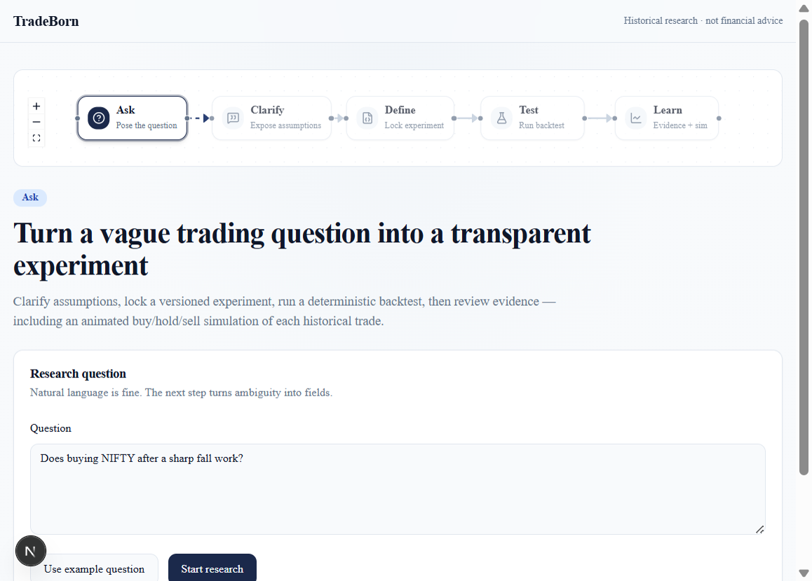
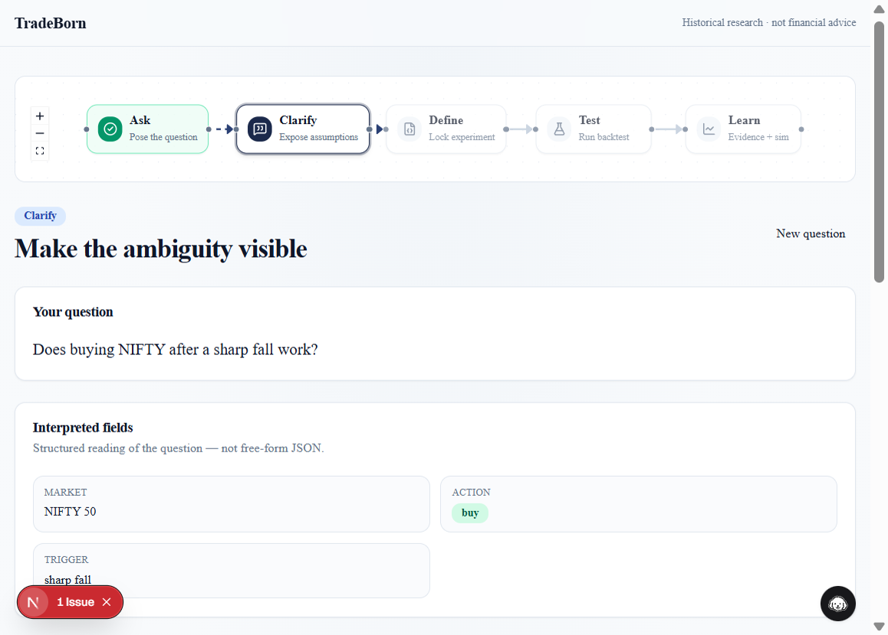
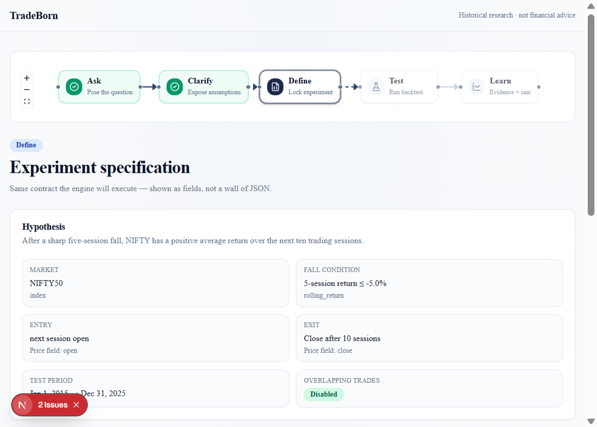
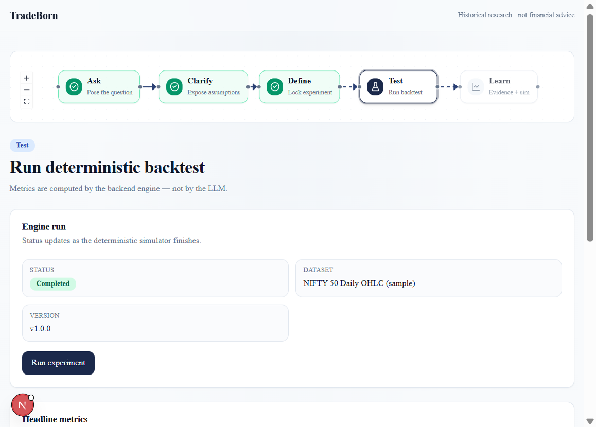
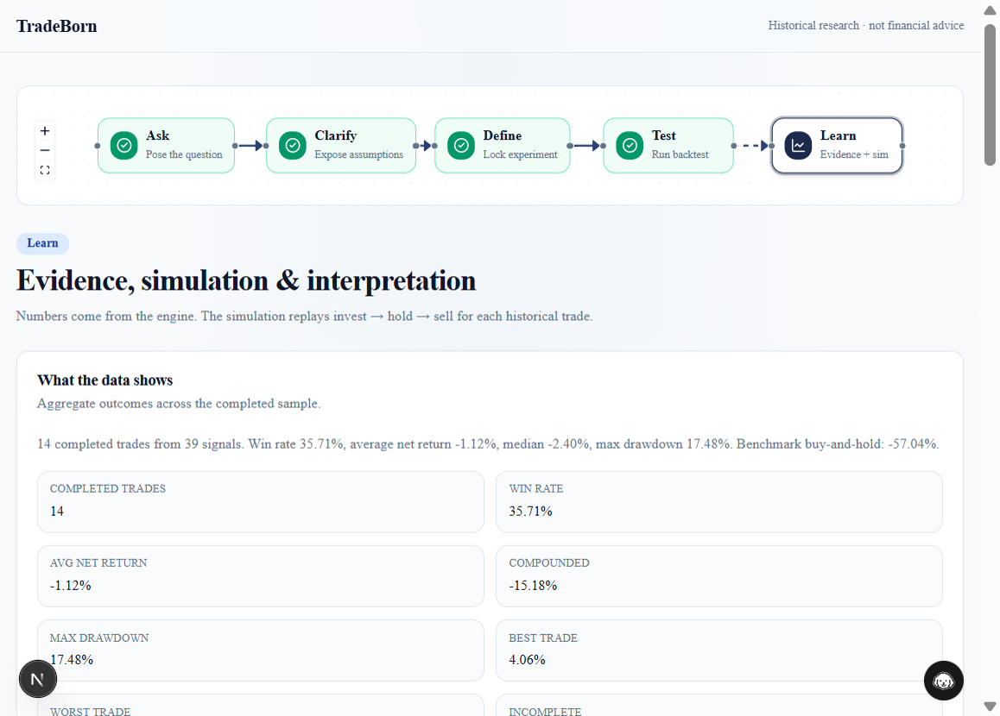
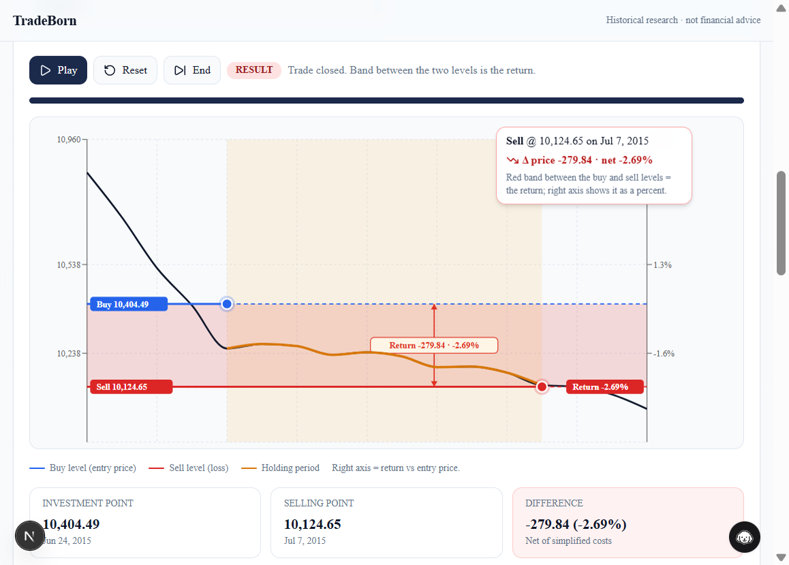

# TradeBorn

A trading **research** prototype — not a trading bot.

You type a vague question like *“Does buying NIFTY after a sharp fall work?”*  
The app helps you clarify what that means, runs a **deterministic** historical backtest on sample data, then shows numbers from the engine and (separately) an AI interpretation.

> Historical research only. Not investment advice. No live trading.

---

## UI walkthrough (current product)

The web app uses a **shadcn-style** layout (cards, badges, field grids) plus a **React Flow** stage graph across Ask → Learn. Experiment details are shown as **labeled fields**, not raw JSON walls. Learn includes an **animated trade simulation**: the plot fills in as the playhead moves, zooms on buy and sell, and shades the return between those two points.

### Ask — pose the question



### Clarify — structured interpretation + editable parameters



Market / action / trigger appear as fields. Threshold is edited as a **percent** (e.g. `5` → engine `-5%`).

### Define — experiment as fields (JSON optional)



### Test — deterministic engine run



### Learn — metrics + live trade simulation



GitHub’s README viewer does not play a repo-relative `<video>` tag. The file is in the repo — open it on GitHub to watch:

**[▶ Watch the trade simulation](https://github.com/Prattaykun/TradeBorn/blob/main/assets/trade_journey.mp4)**

[](https://github.com/Prattaykun/TradeBorn/blob/main/assets/trade_journey.mp4)

On Learn, **Play** walks a real historical trade on OHLC from `GET /api/backtests/:id/bars`. The close path is **drawn in from the left** — only bars the playhead has reached exist; the area under that segment fills as it grows.

1. The plot paints toward the entry bar.
2. The camera **zooms in** on the buy point, holds, and labels it **Buying**, with a normal from that point to the price axis.
3. It **zooms back out** and continues at a steady pace through the amber holding window.
4. At exit it **zooms in** again, labels **Selling**, and drops a normal from that point to the price axis.
5. It zooms out and finishes. The band between the two plot points is shaded **green for profit, red for loss**, with Δ price marked as return on the right-hand axis.

---

## User flow (what you actually click)

```text
Ask  →  Clarify  →  Define  →  Test  →  Learn
 /        /clarify     /define    /test     /learn
```


| Step        | What you do                                               | What happens                                                        |
| ----------- | --------------------------------------------------------- | ------------------------------------------------------------------- |
| **Ask**     | Enter a question → Start research                         | API creates a `research_session` and runs clarification             |
| **Clarify** | See assumptions / missing params; accept defaults or edit | API saves your parameters                                           |
| **Define**  | Review the experiment as fields (JSON optional)           | API stores a versioned `experiment_definition`                      |
| **Test**    | Click Run                                                 | Engine loads OHLC from DB, simulates trades, saves metrics + trades |
| **Learn**   | Metrics, charts, animated trade sim, AI text              | UI loads saved backtest; AI explains **frozen** numbers only        |


The LLM never calculates win rate, returns, or drawdown. Those come only from the backtest engine.

---


## How data flows (source → process → screen)

```text
┌─────────────────────┐
│ data/nifty50_daily  │  seeded once into Neon
│ .csv (OHLC bars)    │──────┐
└─────────────────────┘      │
                             ▼
┌─────────────────────┐   ┌──────────────────┐   ┌─────────────────┐
│ Your question       │──▶│ Clarification    │──▶│ Experiment JSON │
│ (plain text)        │   │ (structured)     │   │ (parameters)     │
└─────────────────────┘   └──────────────────┘   └────────┬────────┘
                                                          │
                                                          ▼
                                                 ┌─────────────────┐
                                                 │ Backtest engine │
                                                 │ (deterministic) │
                                                 └────────┬────────┘
                                                          │
                          ┌───────────────────────────────┼───────────────────────────────┐
                          ▼                               ▼                               ▼
                   metrics JSON                    trade rows                      warnings[]
                   (win rate, etc.)                (each trade)                    (sample size…)
                          │                               │                               │
                          └───────────────────────────────┼───────────────────────────────┘
                                                          ▼
                                                 Learn page (metrics + trade sim + charts)
                                                          │
                                                          ▼
                                                 AI explain (optional)
                                                 + knowledge RAG citations
                                                 (does NOT change metrics)
```


### What passes where


| From → To                               | Payload (shape)                    | Processing                                                                                |
| --------------------------------------- | ---------------------------------- | ----------------------------------------------------------------------------------------- |
| Browser → `POST /api/research/sessions` | `{ question: string }`             | LLM/heuristics → **Clarification** object; saved on session                               |
| Clarify form → `POST .../clarify`       | `{ acceptDefaults, parameters? }`  | Merges edits into session + builds defaults                                               |
| Clarify → `POST .../experiment`         | Full **ExperimentDefinition** JSON | Versioned row in `experiment_definitions`                                                 |
| Test → `POST /api/experiments/:id/run`  | (id only)                          | Loads bars for symbol/dates → `runBacktest()` → saves `backtest_runs` + `backtest_trades` |
| Learn → `GET /api/backtests/:id`        | —                                  | Returns saved **metrics** + warnings                                                      |
| Learn → `GET /api/backtests/:id/trades` | —                                  | Returns trade list for the table + simulation                         |
| Learn → `GET /api/backtests/:id/bars`   | `?from=&to=`                       | OHLC path for the animated invest/hold/sell chart                     |
| Learn → `POST /api/ai/explain-results`  | `{ backtestId }`                   | RAG over knowledge markdown + LLM text; metrics copied in, never recalculated |


### Experiment JSON (Define / engine input)

Example of what the engine receives:

```json
{
  "market": { "symbol": "NIFTY50", "asset_type": "index" },
  "condition": { "type": "rolling_return", "window_sessions": 5, "threshold": -0.05 },
  "entry": { "timing": "next_session_open", "price_field": "open" },
  "exit": { "type": "fixed_holding_period", "holding_sessions": 10, "price_field": "close" },
  "test_period": { "start": "2015-01-01", "end": "2024-12-31" },
  "costs": { "round_trip_bps": 10, "slippage_bps": 5 },
  "allow_overlapping": false,
  "hypothesis": "..."
}
```


### Metrics JSON (engine output → Learn cards/charts)

```json
{
  "signal_count": 39,
  "completed_trades": 39,
  "win_rate": 0.3333,
  "average_net_return": -0.0098,
  "median_net_return": -0.0176,
  "cumulative_compounded_return": -0.3307,
  "max_drawdown": 0.3639,
  "benchmark_return": -0.5704,
  "equity_curve": [{ "date": "2015-07-07", "equity": 0.973 }],
  "return_distribution": [-0.0269, -0.0135, ...]
}
```


### About search / RAG (often confused with the charts)


| Feature                                                                               | Used for Learn metrics?         | When it runs                                                                     |
| ------------------------------------------------------------------------------------- | ------------------------------- | -------------------------------------------------------------------------------- |
| **Backtest engine + CSV**                                                             | **Yes** — charts, cards, trades | On **Test → Run**                                                                |
| **Knowledge RAG** (pgvector / FTS over `data/knowledge/*.md`)                         | No                              | On **Learn → explain** (citations about bias, costs, sample size)                |
| **Web search** (DuckDuckGo → Wikipedia → MiniSearch; Brave only if you pay for a key) | No                              | Optional agent/`POST /api/search` — **not** required for the core Ask→Learn demo |


---

## Example queries (what changes at each step)

Same pipeline for every question. What changes is the **clarification interpretation**, the **experiment parameters**, then the **engine numbers** and the **AI wording** on Learn. Metrics below for the default case match a typical seeded run; other examples show *how* results shift (exact trade counts depend on your CSV window).

### Shared path (every example)

```text
question text
  → POST /api/research/sessions          → Clarification JSON + OpenUI cards
  → POST .../clarify  (accept or edit)   → merged parameters
  → POST .../experiment                  → ExperimentDefinition saved
  → POST /api/experiments/:id/run        → bars from Neon → metrics + trades
  → GET backtest + trades + explain      → Learn UI
```

---

### Example A — default demo question

**Ask**

> Does buying NIFTY after a sharp fall work?

**Clarify (what the system fills in)**

| Field | Value |
|-------|--------|
| Interpretation | market=`NIFTY 50`, action=`buy`, trigger=`sharp fall` |
| System defaults | 5-session fall ≤ **−5%**, entry **next open**, hold **10** sessions, costs **10 bps** RT |
| Missing params surfaced | instrument, threshold, window, holding period, test period, costs |

**Define / engine input (defaults)**

```json
{
  "market": { "symbol": "NIFTY50", "asset_type": "index" },
  "condition": { "type": "rolling_return", "window_sessions": 5, "threshold": -0.05 },
  "entry": { "timing": "next_session_open", "price_field": "open" },
  "exit": { "type": "fixed_holding_period", "holding_sessions": 10, "price_field": "close" },
  "hypothesis": "After a sharp five-session fall, NIFTY has a positive average return over the next ten trading sessions."
}
```

**Test → Learn (illustrative seeded run)**

| Output | Typical shape |
|--------|----------------|
| Trades | ~**39** completed (non-overlapping) |
| Win rate | ~**33%** |
| Avg net return | slightly **negative** |
| Charts | equity curve + return distribution from those trades |
| AI explain | Talks about **small sample**, costs, look-ahead avoidance — cites knowledge docs; **does not invent new metrics** |

**UI change vs a blank start:** Clarify cards already “know” buy + NIFTY + fall; you mostly confirm thresholds.

---

### Example B — stricter crash (fewer signals)

**Ask**

> Does buying NIFTY after a 10% drop over 10 days work?

**What changes vs Example A**

| Step | Change |
|------|--------|
| Clarify | Trigger still “fall”, but LLM/heuristics + your edits push **threshold → −0.10**, **window → 10** |
| Define | `condition: { window_sessions: 10, threshold: -0.10 }` |
| Test | Engine finds **fewer** qualifying bars (harder filter) |
| Learn | **Fewer trades**, wider uncertainty; AI wording stresses **thin sample** more; win rate / avg return are whatever the engine computed for *this* filter — not comparable 1:1 to A without noting the rule change |

```json
{
  "condition": { "type": "rolling_return", "window_sessions": 10, "threshold": -0.10 },
  "exit": { "type": "fixed_holding_period", "holding_sessions": 10, "price_field": "close" }
}
```

**Flow note:** Same APIs as A. Only the experiment JSON (and therefore Neon bar scan + trade list) differs.

---

### Example C — same question, longer hold (you edit on Clarify)

**Ask** (same as A)

> Does buying NIFTY after a sharp fall work?

**Clarify edit:** set holding period to **20** sessions (keep −5% / 5-day fall).

| Step | Change |
|------|--------|
| Clarify request body | `{ "acceptDefaults": false, "parameters": { "holding_sessions": 20, ... } }` |
| Define | `exit.holding_sessions: 20` |
| Test | Same **signal dates** as A (same fall rule), but **exit prices** are ~10 sessions later → different gross/net returns |
| Learn | Trade table `exit_date`s move out; equity curve shape changes; AI may discuss **longer horizon** / path dependence |

```json
{
  "condition": { "window_sessions": 5, "threshold": -0.05 },
  "exit": { "holding_sessions": 20, "type": "fixed_holding_period", "price_field": "close" }
}
```

---

### Example D — vague question (more ambiguity on Clarify)

**Ask**

> Is mean reversion real in India?

**Clarify (typical)**

| Field | Value |
|-------|--------|
| Interpretation | market=`null` or guessed, action=`unknown`, trigger unclear |
| userStated | “Instrument not clearly stated”, “Direction unclear”, “Trigger unclear” |
| Questions | Which instrument? What fall / entry / hold? What period? |
| proposedDefaults | Still the **same NIFTY50 template** so you can run *something* after accepting defaults |

**Define → Test → Learn if you accept defaults**

Same engine path as Example A (NIFTY50 −5% / 5d / 10d hold).  
**Response difference is mostly on Clarify/OpenUI** (more warning cards, weaker interpretation) — not a different data source. Learn metrics only diverge if you change parameters before Run.

---

### Example E — shorter lookback (more signals, noisier)

**Ask / Clarify edit**

> Buy NIFTY after any 3-day drop of 2% or more — hold 5 days.

| Step | Change |
|------|--------|
| Define | `window_sessions: 3`, `threshold: -0.02`, `holding_sessions: 5` |
| Test | **More** overlapping candidates; with `allow_overlapping: false` you still skip busy periods, but signal count usually **rises** vs A |
| Learn | Busier trade table; AI/RAG more likely to flag **parameter mining / overfitting** risk |

```json
{
  "condition": { "type": "rolling_return", "window_sessions": 3, "threshold": -0.02 },
  "exit": { "type": "fixed_holding_period", "holding_sessions": 5, "price_field": "close" },
  "allow_overlapping": false
}
```

---

### Side-by-side: what the user sees change

| Example | Clarify feel | Experiment knobs that matter | Learn metrics | Learn AI text |
|---------|--------------|------------------------------|---------------|---------------|
| **A** Default sharp fall | Clear buy + NIFTY + fall | −5% / 5d / hold 10 | Baseline (~dozens of trades) | Sample size, costs, “no proven edge” |
| **B** 10% / 10d | Same flow, stricter rule | −10% / 10d | Fewer trades | Emphasizes thin sample |
| **C** Hold 20 | Edit one field | hold 20 | Same signals, different exits | Longer holding horizon |
| **D** Vague | Lots of missing params | Defaults ≈ A if accepted | ≈ A if defaults accepted | Same metrics story; Clarify was the big UX change |
| **E** Mild 3d/−2% | Mild mean-reversion | −2% / 3d / hold 5 | More trades | Overfitting / noise warnings |

**What never changes with the question text alone:** OHLC still comes from seeded `NIFTY50` bars in Neon (unless you change symbol/dataset). Web search is not what fills the charts.

---


## Architecture

```text
┌──────────────────────────────────────────┐
│  apps/web  (Next.js App Router)          │
│  Ask / Clarify / Define / Test / Learn   │
│  React Flow stages · shadcn-style UI     │
│  Recharts · trade simulation · OpenUI    │
└───────────────────┬──────────────────────┘
                    │ HTTP JSON
┌───────────────────▼──────────────────────┐
│  apps/api  (Fastify)                     │
│  • research sessions & experiments       │
│  • deterministic backtest engine         │
│  • LangGraph/LangChain agent tools       │
│  • Gemini (or Groq/OpenAI/Ollama)        │
│  • search fallbacks + RAG                │
└───────────────────┬──────────────────────┘
                    │ Prisma
┌───────────────────▼──────────────────────┐
│  Neon Postgres + pgvector                │
│  sessions · experiments · bars · runs    │
│  trades · knowledge chunks · search cache│
└──────────────────────────────────────────┘

packages/shared  → Zod schemas shared by web + api
data/            → NIFTY CSV + methodology markdown (seeded)
```

---


## Technology choices (and why)


| Choice                                       | Why                                                                                                 |
| -------------------------------------------- | --------------------------------------------------------------------------------------------------- |
| **Next.js (App Router)**                     | Comfortable stack for the product UI: routes per workflow step, React, easy local/dev deploy.       |
| **shadcn-style UI + React Flow**             | Card/field layout for clarity; stage graph makes Ask→Learn progress visible and clickable.          |
| **Separate Fastify API**                     | Keeps backtesting, DB, and LLM keys off the browser; clear HTTP contract for the UI.                |
| **TypeScript + Zod (**`packages/shared`**)** | Same experiment/clarification shapes on client and server — fewer “UI said X, API expected Y” bugs. |
| **Prisma + Neon Postgres**                   | Hosted DB (no Docker Postgres for this project); fits internship-style demos.                       |
| **pgvector**                                 | Optional RAG for methodology docs next to structured experiment data.                               |
| **Deterministic JS backtest engine**         | Reproducible results; LLM cannot invent win rates.                                                  |
| **LangChain / LangGraph.js**                 | Structured clarification + tool-shaped search/RAG without leaving the Node monorepo.                |
| **OpenUI Lang (allowlisted)**                | Controlled generative UI panels — unknown components rejected.                                      |
| **Recharts + Framer Motion**                 | Engine equity/distribution charts; Learn sim fills the OHLC path, zooms on buy/sell, shades return. |
| **Multi-provider search fallbacks**          | Core demo works without paid search; Brave/Tavily are optional.                                     |


---


## Key assumptions

1. **“NIFTY”** in the demo means the seeded **NIFTY50** daily OHLC CSV (sample/synthetic-style series for reproducibility — not a live exchange feed).
2. **“Sharp fall”** defaults to a **5-session** close-to-close return **≤ −5%**, unless you change it on Clarify.
3. **Entry** is the **next session open** (avoids same-bar look-ahead).
4. **Exit** is close after a fixed holding period (default **10** sessions).
5. **Overlapping trades** are off by default.
6. **Costs** are a simplified bps model (not full brokerage/taxes/impact).
7. Results are **in-sample exploration** — small samples and parameter choices can dominate; no claim of a live edge.
8. **AI text** is interpretation of already-computed metrics + docs — not market data and not advice.

---


## How to run


### Prerequisites

- Node.js **20+**
- **pnpm** 9+ (`npm i -g pnpm`)
- A **Neon** project (pooled + direct connection strings)
- Optional: Google/OpenAI/Groq API key for smarter clarify/explain (heuristics work without it)


### 1. Install

```bash
cd TradeBorn
pnpm install
```


### 2. Environment

```bash
cp .env.example .env
```

Edit `.env`:


| Variable                                     | Required?           | Notes                                                                 |
| -------------------------------------------- | ------------------- | --------------------------------------------------------------------- |
| `DATABASE_URL`                               | **Yes**             | Neon **pooled** URL (`sslmode=require`; `pgbouncer=true` recommended) |
| `DIRECT_URL`                                 | **Yes** for migrate | Neon **direct** host (**no** `-pooler`)                               |
| `LLM_PROVIDER` / `LLM_API_KEY` / `LLM_MODEL` | No                  | e.g. `google` + Gemini key                                            |
| `EMBEDDING_*`                                | No                  | If unset, RAG falls back to keyword/FTS                               |
| `NEXT_PUBLIC_API_URL`                        | No                  | Default `http://localhost:4000`                                       |
| `BRAVE_SEARCH_API_KEY`                       | No                  | **Paid only** — leave blank; free search fallbacks still work         |


Also copy env for the API package if you run Prisma from `apps/api`:

```bash
cp .env apps/api/.env
```

On Neon (SQL editor), once:

```sql
CREATE EXTENSION IF NOT EXISTS vector;
```


### 3. Database + seed

```bash
pnpm db:generate
pnpm --filter @TradeBorn/api exec prisma migrate deploy
pnpm db:seed
```

If migrate fails because the Neon DB already has **other** project tables, **do not** use destructive `db push --accept-data-loss`. Prefer executing only this project’s migration SQL (see [localrun.md](./localrun.md)).

Seed imports:

- `data/nifty50_daily.csv` → bars + checksum  
- `data/knowledge/*.md` → knowledge chunks (embeddings if configured)


### 4. Start

Terminal A — API:

```bash
pnpm dev:api
```

Terminal B — web:

```bash
pnpm dev:web
```

Or both: `pnpm dev`

- Web: [http://localhost:3000](http://localhost:3000)  
- API health: [http://localhost:4000/health](http://localhost:4000/health)


### 5. Demo path

1. Open [http://localhost:3000](http://localhost:3000)
2. Use the example question → **Start research**
3. **Clarify** — accept defaults or change threshold / holding
4. **Define** — confirm JSON
5. **Test** — **Run experiment**
6. **Learn** — metrics/charts/trades from the engine; AI block labelled separately


### Tests

```bash
pnpm test
```

More troubleshooting (Neon wake, Gemini model ids, shared DB): **[localrun.md](./localrun.md)**.

---


## Project layout

```text
apps/web          Next.js UI
apps/api          Fastify + engine + AI + search/RAG
packages/shared   Shared Zod types
data/             CSV + knowledge markdown
localrun.md       Detailed runbook
```

---


## License / disclaimer

Prototype for research UX and engineering demonstration.  
Not investment advice. No brokerage integration. Sample OHLC is for reproducible demos.